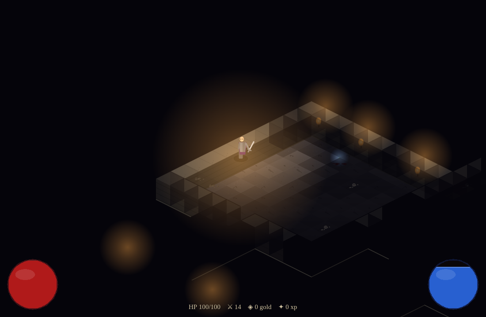

# Gothic Depths

A Diablo 1–inspired, dark-gothic **isometric action RPG** that runs entirely in
the browser. Every art asset — floor and wall tiles, the player, enemies, items,
torch light — is **generated procedurally in code** at load time. No image files,
no external art, no backend.

Built with **TypeScript + Vite + [PixiJS](https://pixijs.com) v8**.



## Features

- **Procedural assets**: shaded isometric stone prisms, animated 8-direction
  humanoid sprites, potions/gold/weapons — all drawn to offscreen canvases and
  uploaded as WebGL textures (`src/assets/`).
- **Procedural dungeons**: rooms + corridors with doors and wall torches, seeded
  for reproducibility (`src/world/dungeon.ts`).
- **Torch-lit fog of war**: a flickering light radius reveals the dungeon as you
  explore; seen-but-unlit areas stay dimly remembered (`src/world/lighting.ts`).
- **Click-to-move** with A\* pathfinding around walls (`src/core/pathfinding.ts`).
- **Combat**: melee swings and a mana-fueled magic bolt; enemies (skeletons,
  rotting dead, dark cultists) with wander → chase → attack AI.
- **Loot & progression**: gold, health/mana potions, better blades, XP, and a
  Diablo-style HUD with health/mana orbs.

## Controls

| Input | Action |
| --- | --- |
| **Left click** (hold) | Move toward the cursor / attack the target under it |
| **Right click** | Cast a magic bolt toward the cursor (costs mana) |
| Click an enemy | Approach and melee it |

Pick up potions and gold by walking over them. Die and you can descend into a
freshly generated dungeon.

## Run locally

```bash
npm install
npm run dev      # http://localhost:5173/rpg/
```

Other scripts:

```bash
npm run build      # type-check + production build into dist/
npm run preview    # serve the production build
npm run typecheck  # tsc --noEmit
```

## Deploy on GitHub Pages

The game is fully static, so it deploys to GitHub Pages with no server.

1. In the repo, go to **Settings → Pages → Build and deployment → Source** and
   choose **GitHub Actions**.
2. Push to a branch covered by `.github/workflows/deploy.yml`. The workflow
   builds with Vite and publishes `dist/`.
3. The site is served at `https://<user>.github.io/rpg/`.

The Vite `base` is set to `/rpg/` (the repo name) in `vite.config.ts` so all
asset URLs resolve under that subpath. If you fork to a differently named repo,
update `base` to match.

## Project layout

```
src/
  core/      iso math, A* pathfinding, seeded RNG, input
  assets/    procedural tile / actor / item generators + texture store
  world/     dungeon generation, tilemap rendering, lighting & fog
  entities/  player, enemies (AI), projectiles, loot
  systems/   camera, enemy spawner, loot tables
  ui/        HUD (orbs, monster bar), title/death overlays
  main.ts    game bootstrap + loop
```
